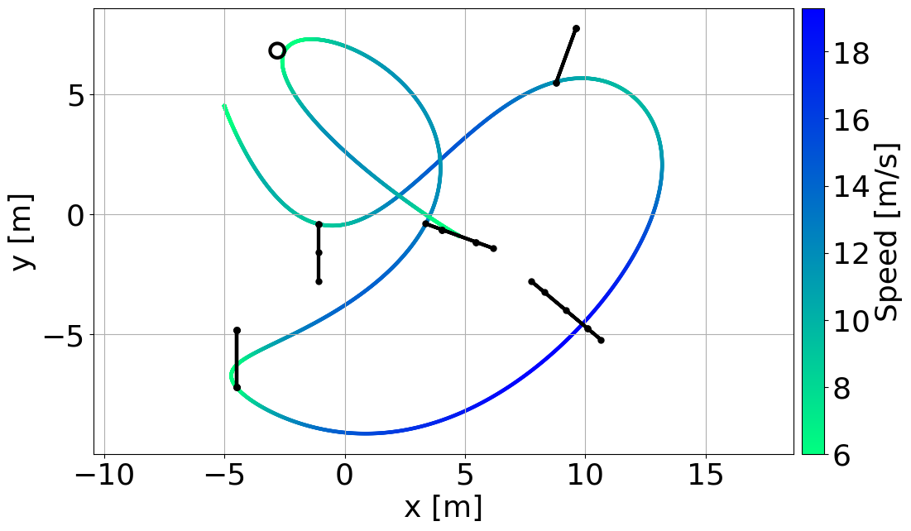
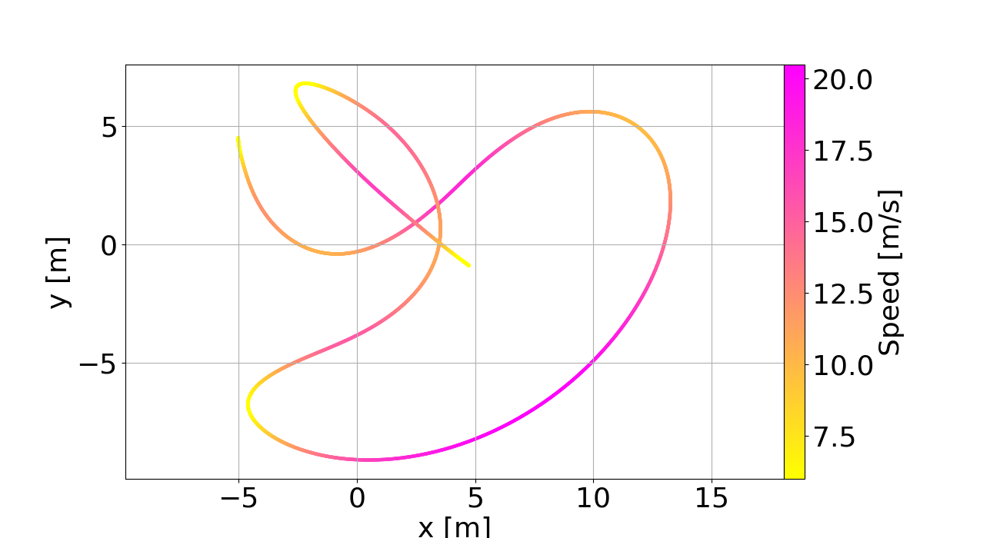
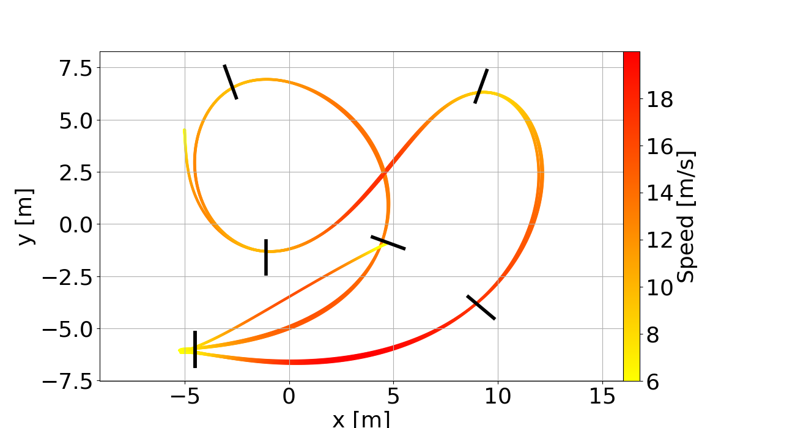

# TOGT-Planner

**Time-Optimal Gate-Traversing (TOGT) Planner** is a light-weight racing trajectory generator that can accommondate a broad range of race tracks comprising gates with diverse shapes and sizes. It provides high trajectory quality in terms of dynamically feasibility by employing differential-flat nature of quadrotor systems and incorporating single-rotor thrust constriants.

## Related Papers

If the TOGT planner helps your academic projects, please cite our paper. Thank you!

- **Time-Optimal Gate-Traversing Planner for Autonomous Drone Racing**, Chao Qin, Maxime SJ Michet, Jingxiang Chen, and Hugh H.-T. Liu,  IEEE International Conference on Robotics and Automation (ICRA-2024)

- **Time-Optimal Planning for Quadrotors: Reaching Constant Computation Costs for Arbitrary Distance**, Chao Qin, Jingxiang Chen, Yifan Lin, Abhishek Goudar, and Hugh H.-T. Liu, (On-going)

## Updates:

- **Feb. 19, 2024** - First version released
- **May. 2, 2024** - Add three different variances of the TOGT planner and make the project public

## Install on Ubuntu

#### 1. Clone repo

```
git clone https://github.com/FSC-Lab/TOGT-Planner/
cd TOGT-Planner
```

#### 2. Build the library

```
mkdir build; cd build
cmake ..
make
```

#### 3. Run the example

```
./tests
```

## Visualize the TOGT trajectory
The default race track `race_uzh_7g_multiprisma.yaml` contains 7 gates with different shapes. They are triangle, rectangle, pentagon, rectangle, rectangle, hexagon, and ball gates in order. The resulting lap time is `8.23` s.
```
cd ../scripts/plots
python3 plot_togt_traj.py

```



## Visualize the TOGT-Refined trajectory
The TOGT trajectory can be refined to reach true time optimality. We take the optimal gate-traveral point as the waypiont, and use the obtained time allocation to compute a proper node number for each segment bewteen two consecutive waypoints. Then, we warm-start the multiple-shooting method with the planned TOGT trajectory. The following python script conducts the refinement for us. The resulting lap time is `7.01` s.
```
cd ../scripts/togt_refine
python3 togt_refine.py
cd ../plots
python3 plot_togt_refined_traj.py
```


## Visualize the AOS trajectory for waypoint flight

Another example is the Split-S track provided in [this](https://www.science.org/doi/full/10.1126/scirobotics.abh1221) paper. It consists of 19 waypoints in total with a tolerance of 0.3 m for each point. Below is our generated trajectory. The AOS stands for automatic optimal synthesis, a novel framework to address time-optimal planning problem. It is part of the result from the second reference above. It takes around 6 seconds to solve the minimum-time trajectory that originally requires ~50 minutes in previous methods. The resulting lap time is only 1~2% longer than the optimal solution. We will provide in-depth analytical analysis in the paper about its distance-insensitive nature. The resulting lap time is `17.93` s where the true optimal is `17.56` s.


```
cd ../scripts/plots
python3 plot_aos_traj.py
```


## Visualize the AOS-TOGT trajectory

The TOGT and AOS planners can be seemly integrated, contributing to a super efficienct and accurate method to solve the time-optimal gate-traversing problem. The code below can visualize the result. The resulting lap time is `16.83` s, which is 4% faster than time-optimal waypoint flights.

```
cd ../scripts/plots
python3 plot_aos_togt_traj.py
```


## Acknowledgements

- We use [LBFGS-Lite](https://github.com/ZJU-FAST-Lab/LBFGS-Lite) as the internal solver: An Easy-to-Use Header-Only L-BFGS Solver.
- We use [GCOPTER](https://github.com/ZJU-FAST-Lab/GCOPTER) for geometric constraint elimination.
- We use several utility functions in [Agilicious](https://github.com/uzh-rpg/agilicious) to facilitate development.
- We refer to [FastFly](https://github.com/BIT-KAUIS/Fast-fly) for the implementation of the multiple shooting method.

